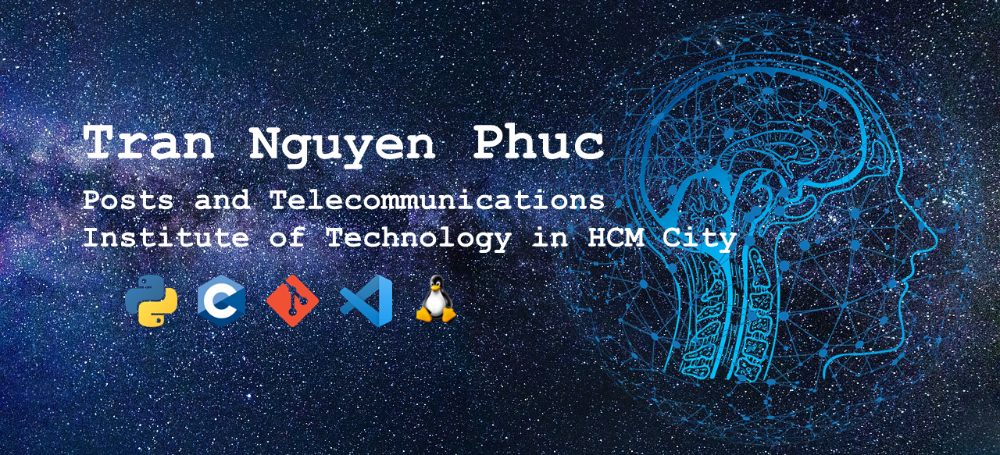

<h2 align="center">🛠 Technologies and Tools 🛠</h2>
 
<!-- https://simpleicons.org/ -->

&nbsp;

&nbsp;

&nbsp;

&nbsp;

&nbsp;

&nbsp;

&nbsp;

&nbsp;

&nbsp;

&nbsp;
 
<h2 align="center">👽 Where to find me 👽</h2>
 
<!-- https://icons8.com -->

  
  
  
  

 

<h2 align="center">📖 PROJECT 📖</h2>
 

  <strong>🛠️ Project STM32: <a href="https://github.com/TNPhuc/STM32_F401RE---HE_THONG_CANH_BAO" target="_blank">THE ALARM SYSTEM USES STM32 NUCLEO F401RE</a></strong>
   
  <strong>🛠️ Project Arduino: <a href="https://github.com/TNPhuc/Arduino---Khoa-cua-thong-minh" target="_blank">THE SMART DOOR LOCK SYSTEM USES ARDUINO UNO</a></strong>
   

<h2 align="center">📖 PROJECT 📖</h2>
 

  <strong>📞 Contact me on Facebook: <a href="https://www.facebook.com/profile.php?id=100011416625685" target="_blank">Trần Nguyễn Phúc</a></strong>
   
  <strong>📧 Email me: <a href="mailto:trannguyenphuc206082@gmail.com" target="_top">trannguyenphuc206082@gmail.com</a></strong>

 
<h2 align="center">📑 My Favorites Quote 📑</h2>
 
<h5 align="center">"Never stop learning and developing yourself. That is the key to surpassing your limits.</h5>
 
<h5 align="center">-- Tran Nguyen Phuc --</h5>

